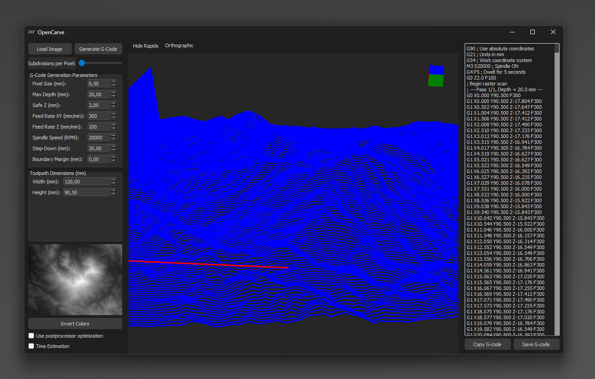

# OpenCarve
<div style="text-align: center;">

</div>


OpenCarve is a tool for converting grayscale images (e.g. heightmaps) into G-code for 3D surface machining. The application offers an easy-to-use interface that lets you adjust parameters, generate optimized G-code, and visualize the resulting toolpath in 3D.

## Features

- **Image-to-G-Code Conversion:**  
  Converts grayscale images into precise G-code for CNC machining.
- **Parameter Configuration:**  
  Adjust settings such as pixel size, maximum depth, safe Z height, feed rates, spindle speed, step-down, and boundary margin.
- **3D Visualization:**  
  View the generated toolpath interactively in a 3D viewer.
- **G-Code Postprocessor:**  
  Optimizes the generated G-code by merging consecutive commands with identical parameters, reducing file size and improving execution.
- **Time Estimation:**  
  Provides an average processing time based on the generated G-code.

## Installation

1. Clone the repository:
   ```bash
   git clone https://github.com/wytr/OpenCarve.git

2. Install dependencies:
    ```bash
    pip install -r requirements.txt

(Make sure you have installed packages such as PyQt5, NumPy, Pillow, and PyOpenGL.)

## Usage
1. Run the application:
    ```bash
    python main.py

2. Load Image:

    Click the Load Image button to open a grayscale image.

3. Configure Parameters:

    Adjust parameters (pixel size, maximum depth, safe Z, feed rates, spindle speed, step-down, boundary margin) as needed.
4. Generate G-Code:

    Click Generate G-Code. The G-code is generated and displayed in a dedicated panel. You can then copy or save the G-code using the provided buttons.
5. Transfer G-Code:
    
    The generated G-code can be sent to your CNC machine.

## Parameter Settings Overview

- **Pixel Size (mm):**  
  Defines the scale of the conversion. It sets the distance between generated G-code paths.  
  *Example:* For a 240-pixel wide image and a total toolpath width of 120 mm, the pixel size is 0.5 mm, meaning each pixel represents a 0.5 mm increment.

- **Maximum Depth (mm):**  
  Specifies the deepest cut. Darker areas in the image will result in cuts that approach this depth.

- **Safe Z (mm):**  
  Sets the safe travel height for rapid (non-cutting) movements. This helps avoid collisions when moving between cutting operations.

- **Feed Rate XY (mm/min):**  
  Determines the speed at which the tool moves horizontally (X and Y axes) during cutting.

- **Feed Rate Z (mm/min):**  
  Determines the speed for vertical (Z-axis) movements, used when plunging into or retracting from the material.

- **Spindle Speed (RPM):**  
  Defines the rotation speed of the spindle during cutting operations.

- **Step-Down (mm):**  
  Specifies the incremental depth per pass. If the maximum depth isn’t achieved in one pass, the tool will gradually cut deeper using this step value.

- **Boundary Margin (mm):**  
  Adds a margin around the toolpath. The effective machining area is reduced by twice the margin (one on each side).

- **Toolpath Dimensions (mm):**  
  Sets the overall width and height of the generated toolpath. The pixel positions are mapped to these dimensions, ensuring the final work area meets your specified size.

- **Subdivisions:**  
  (Optional) Determines the number of interpolation steps between adjacent pixels. This can smooth transitions between depth changes.

## 3D Viewer Controls

The 3D viewer offers interactive navigation of the generated toolpath. Here’s a quick overview of the controls:

- **Orbit:**  
  - **Middle Mouse Button:** Press and hold the middle mouse button to rotate the view around the scene.  
  - **Default Mode:** If no modifier keys are held (or if the Shift or Control modifiers aren’t used), the viewer remains in orbit mode.

- **Pan:**  
  - **Both Left and Right Mouse Buttons:** Holding down both the left and right mouse buttons simultaneously will activate pan mode, allowing you to move the view laterally.  
  - **Shift + Middle Mouse Button:** Alternatively, holding the Shift key while pressing the middle mouse button also triggers pan mode.  
  - *Visual Cue:* When panning, the cursor changes to a navigation cross (SizeAllCursor).

- **Zoom:**  
  - **Mouse Wheel:** Scrolling the mouse wheel zooms in and out, adjusting the camera distance accordingly.

- **Navigation Cube:**  
  - A small orientation cube is displayed in the top-right corner. Clicking on a face of the cube will snap the view to a predefined orientation, helping you quickly reset the view.

These controls provide a flexible way to inspect the toolpath from various angles and distances.


## Screenshots

### Overview Screen


### 3D Visualization (Detail with Hidden Rapids)


### 3D Visualization (HSKL-Logo)


### Time Estimation Example


### Example Heightmap


### Doom-Guy Bas-relief


## Technologies Used

+ Python: The main programming language.
+ PyQt5: For creating the graphical user interface.
+ OpenGL: For real-time 3D visualization of the toolpath.
+ NumPy & Pillow: For image processing and numerical computations.

## License

OpenCarve is licensed under the GNU GPLv2. See LICENSE for details.

## Contributing

Contributions are welcome! Please fork the repository and submit your pull requests.
